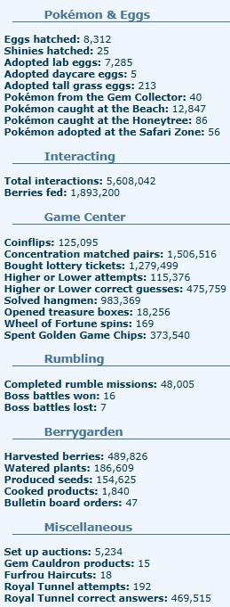
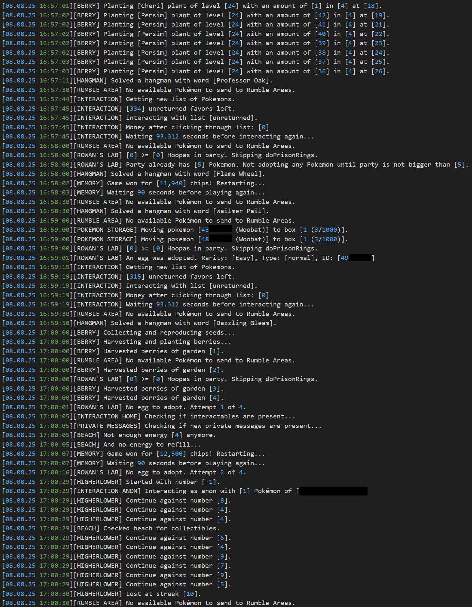
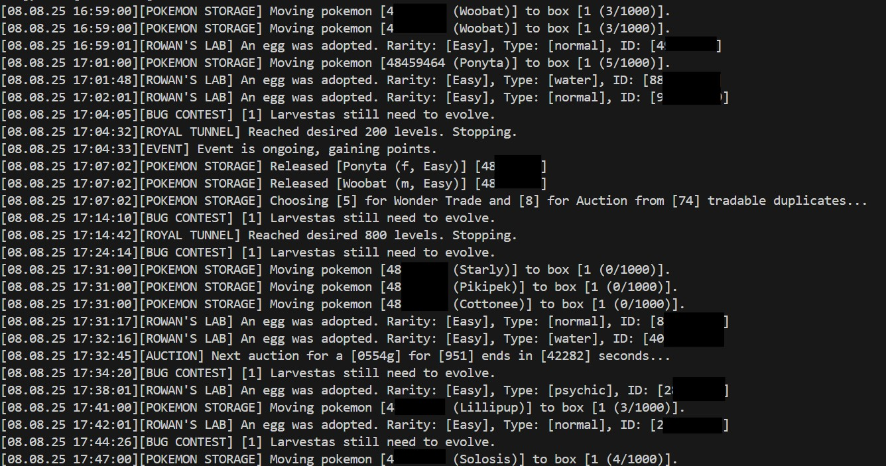
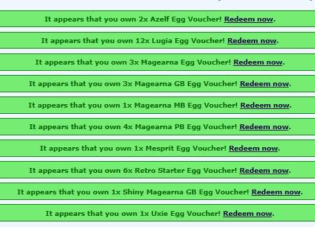
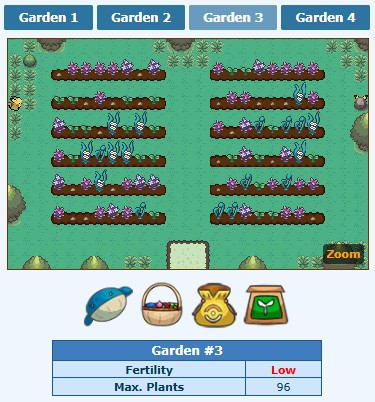

<p align="center">
  <a href="" rel="noopener">
    
  </a>
</p>

<h3 align="center">PokéHeroes Bot</h3>

<div align="center">

[](https://nodejs.org/)
[](https://github.com/Michael1337/pokeheroesbot/issues)
[](https://github.com/Michael1337/pokeheroesbot/pulls)
[](/LICENSE)

</div>

---

<div align="center">

  The most sophisticated bot for PokéHeroes ([pokeheroes.com](https://pokeheroes.com)). Automates almost everything, including daily interactions, events, minigames, berries, storages and much more.  

</div>

## 📝 Table of Contents

- [About](#about)
- [Features](#features)
- [Screenshots](#screenshots)
- [How it works](#working)
- [Configuration](#configuration)
- [Installation](#installation)
- [TODOs](#todos)

## 🧐 About <a name="about"></a>

This project is a Node.js-based bot for automating gameplay actions on the Pokémon fan browser clicker game [pokeheroes.com](https://pokeheroes.com).  
From their description, "PokéHeroes is a Pokémon online roleplay game where you explore mysterious areas, hunt for shiny Pokémon and complete quests with many legendaries!"  
This bot is not merely a userscript running in a web browser. It is a node.js application that is supposed to run on a server or personal computer.
Developed for personal use and easily deployable for anyone with a bit of technical knowledge.

## 💪 Features <a name="features"></a>
**Note:** Many of these features are configurable to be less suspicious or to suit your preferences.

- Performs up to the cap of 100,000 interactions per day.  
  - Strokes eggs, trains Pokémon, and feeds Pokémon.  
  - Returns favors and feeds homepage eggs and Pokémon.  
  - Handles the cheat popup reliably.  
  - Considers Speed Click Saturdays and distributes all 100,000 interactions evenly across all 12 SCS time slots (~8,000 interactions per slot).  
  - Can be adjusted for special events like Shaymin.
- Plays all Game Center games.  
  - Completes the maximum allowed Treasure Hunt, Lottery, Concentration, and Wheel of Fortune plays.  
  - Performs an unsuspicious amount of Coin Flip and Higher or Lower plays while still unlocking the Mewtons eventually.  
  - Regularly completes the Golden Slot (Legend mode).  
  - Solves a Hangman in a set interval, earning a large amount of Game Chips.  
  - Purchases a large number of Magearna Raffle tickets to always get a decent chance to win the raffle (as long as only one player uses the bot).  
  - Purchases all item prizes every day.  
- Adopts new eggs from Rowan's Lab.  
  - Uses an advanced algorithm to determine the best eggs to adopt.  
    - Checking for new eggs every few seconds.
    - Temporarily storing eggs away in case a new rare egg was found while having a full party.
  - Sends notifications about special Rowan quests via email.  
  - Collects Hoopa Prison Rings and adopts Hoopa.  
  - Clicks shiny Ditto to obtain the plushy.  
- Hatches, stores and sorts Pokémon in boxes, building a living Pokédex.  
  - Hatches new Pokémon using the returned favors, but also by using anonymous guest clicks using [Tor](https://en.wikipedia.org/wiki/Tor_(network)) if you set it up.
  - Temporarily stores newly hatched Pokémon in a box for new Pokémon.  
  - Regularly sorts all Pokémon by Pokédex number, shininess, gender, and mega-ability.  
  - Uses an advanced algorithm to determine the best Pokémon to keep, considering Original Trainer (OT), IVs, and level.  
  - Keeps duplicates for evolutions.  
  - Automatically handles most evolutions and form changes, with few exceptions.  
  - Automatically offers duplicate Pokémon for Wonder Trade or auctions them at a low but reasonable price.  
- Collects all Puzzle Pieces.  
  - Unlocks Experience Share after collecting 500 Puzzle Pieces, typically achieved by the bot in a few weeks.  
  - Some puzzles require unusual actions such as the Furfrou salon, which may take longer.  
- Performs daily Shadow Hunts.  
  - Searches through each region for NEW shadow versions and catches a random shadow version if no new one is available.  
- Completes Paldea Research.  
  - Adopts eggs necessary to complete tasks.  
  - Skips unreasonable tasks like hatching a specific Pokémon.  
  - Completes and restarts the research automatically.  
- Handles regular Event Distribution.  
  - Performs hourly interactions and Game Center activities.  
  - Completes 1,000 Royal Tunnel levels every hour for the "Other" category.  
  - Accumulates 1,000 Activity Points hourly, resulting in more than 12 eggs per event, which are claimed automatically.  
- Throws a coin into the Emera Fountain at the start of each day.  
- Claims Dream World Shop tasks every hour.  
  - Skips the task requiring gems.  
  - Checks for received plushies every hour and sends a missing plushie to the sender per received plushie.
- Performs a natural oil massage for the strongest Pokémons (one per type) every day.  
- Performs acupuncture on a Pokémon if required for a missing Pokédex evolution.  
- Handles all of Route 53.  
  - Puts honey on the tree and catches or scares Pokémon.  
  - Collects Celebi when available.  
  - Collects honey from honeycombs.  
  - Checks for Gurdurr to build more honeycombs.  
  - Collects milk and feeds Miltanks.  
- Handles Tall Grass.  
  - Automatically checks unchecked patches of grass whenever possible during hunts.  
  - Waits for more Pokémon of the same species or item to become available.  
- Handles the Safari Zone.  
  - Uses a smart algorithm to determine and catch the rarest available Pokémon in each session.  
  - Currently runs as a separate script and does not operate automatically.  
- Handles all three Emera Square contests.  
  - Wins Oak's Contest by keeping the Pokémon in the party until it is stronger than Oak's Pokémon can ever be.  
  - Dominates the Bug Hatching Contest by searching for and hatching only the best Pokémon in a very short time.  
  - Completes reasonable Beauty Contest tasks by rating all photographs; does NOT create photographs.  
- Handles the beach activities.  
  - Catches fish consistently throughout the day.  
  - Consumes dishes and tips the waiter.  
  - Exchanges valuables with Leah until unlocking the Fisherman's Hat (can take months, unfortunately, if valuables are not bought manually).  
- Handles the Berry Garden.  
  - Plants all seeds; each garden serves a different purpose.  
  - Regularly waters and harvests berries.  
  - Creates new seeds from the best and rarest berries, gradually leveling all berries up to level 100.  
  - Fulfills Bulletin Board orders by cooking the required meals.  
- Executes Wonder Trade and Shiny Wonder Trade, being mindful of rare and Original Trainer (OT) Pokémon.  
- Searches for missing Pokémon at the auction and places bids near the end of auctions.  
- Solves the Gem Cauldron stone process. Is a separate function due to its infrequent requirement.  
- Handles Rumble Areas.  
  - Sends up to six Pokémon on Rumble Missions every five minutes.  
  - Retrieves any Pokémon after completing a Boss Battle or evolution.  
- Handles the Royal Tunnel.  
  - Includes a Pokédex to solve all questions.  
  - Typically solves more than 9,000 questions in a row but stops at 9,000 to avoid appearing on the rank list.  
  - Can pause every 100 questions if desired but usually continues for ongoing Event Distribution.  
  - Sends an email notification if a question is answered incorrectly; manual Pokédex updates are then required.  
- Solves Bill's MissingNo quest every day to adopt it weekly.
- Reads news and sends notifications via email.  
- Reads received private messages and sends notifications via email.  
- Sends a stealth request to the game forum after every action to hide the actual activities.


### 🔎 Suspicion

A note on suspicion: The bot sends a request to the game forum after every action to appear stealthy. This behavior makes it look like the user is simply browsing the forum rather than performing many different, rapid interactions.

Additionally, disabling all profile widgets such as Medals, Plushies, Badges, and Last Activity is recommended to hide most bot activity.

However, some behaviors may still draw attention:

- If configured to do so, the bot can win almost all Magearna raffles. This is what actually got my last account banned. It is advisable to never increase the raffle chance to more than 20 %, and to sell the vouchers on the (anonymous) item market for PD instead of trading, and then selling the PD for nuggets on the item market.  
- The bot solves an inhuman number of Hangman puzzles (one every 2 minutes -> 720 every day). Increasing this number to more than every 10 seconds can trigger the game's automatic anti-cheat system; and even with default settings, high Hangman counts may lead to bans if reviewed by an admin.  
- The bot regularly dominates the Bug Hatching Contest, often placing more than 10 times in the Top 20. To mitigate this, only a few high-scoring Pokémon are submitted for rating, but some may still find the results suspicious.  
- The bot avoids appearing on the rank list or medal rally by limiting interactions and Royal Tunnel levels. However, the total number interactions and fed berries may eventually appear in the ranking, possibly triggering an admin inspection.  
- The bot runs 24/7, but you do not; some users may message you in-game and wonder why you do not respond. Also, a play time of 3,000 hours in 5 months or 8,000 hours in a year was suspicious for many users. You may want to create an account, not use it for a year, and only then start using the bot with it.
- Making too many guest clicks from the Tor network will draw attention from the admins. That's why the bot focuses on hatching Pokémon using guest clicks, but not leveling/evolving them using guest clicks.


## 🎥 Screenshots <a name="screenshots"></a>
  
### Stats:
  
### Logs (detailed version):  
  
### Logs (shorter version):  
  
### Vouchers in the Game Center:  
  
### Berry Garden at a random point in time:  
  


## 💭 How it works <a name="working"></a>
See `package.json` for the full dependency list.

- Written in [Node.js](https://nodejs.org/).
- Schedules jobs using `node-schedule` for regular actions (minigames, interactions, resource checks, etc.).
- Does requests using `node-fetch` and [axios](https://axios-http.com/).
- Parses game content using `Regex` and [Cheerio](https://cheerio.js.org/).
- Handles authentication via `.env`-provided cookies.
- Handles in-game configurations using a structured in-game message for easy adjustments.
- Deploys and runs automatically via [Docker](https://www.docker.com/) and `Docker Compose`.

## ⚙️ Configuration <a name="configuration"></a>

### In-game Requirements

The bot uses many features of the game. For some of the functions, certain assumptions are made by the bot, and you have to make sure these are fulfilled. This includes:  
- Have a Private Message to/with yourself for the config.  
- Have these boxes:  
  - 2+ slots in Egg Storage
  - 1 box called "New"
  - 1 box called "Special" (holding your Miltanks, Combees, and any other Pokémon not to be sold.)
  - 1 box called "Bugs" (for bug-hatching contest)
  - 1 box called "Temp" (size 1,000)
  - 1+ boxes called "Pokedex" (each size 1,000)
  - 1+ boxes called "Duplicates" (each size 1,000)
- Example: [ClickDeeClack](https://pokeheroes.com/userboxes?name=ClickDeeClack)

Also, your game account needs to be able to do some advanced actions. While the following is not strictly necessary to run the bot, it is highly advised for the best performance:  
- Being at least Trainer level 15, preferably level 35.  
- Having Premium. I suggest buying premium for a month by selling your Magearna vouchers (increase hangman interval to 10 seonds in code, and configure a 90 % win rate in the daily raffle for that) and trading the PDs for nuggets. Trading a Manaphy may also be possible, but highly suspicious for a new account. Once you have premium for a month, wait for the next Magearna Master Ball or some Shiny Magearna and sell those until you have 8,000 nuggets for a year of premium. Then adjust the hangman interval to 2 minutes and configure the daily raffle to be at 10 to 20 %.  

### Technical prerequisites

- Node.js >= 22 (Alpine image used in Dockerfile)
- Docker + Docker Compose (for container deployment)

### Environment Configuration (`.env`) <a name="config-env"></a>

The `.env` file contains configuration values and secrets your bot needs to operate. Copy the `.env.template` file and rename your copy to `.env`. Below is a description of each variable:

#### Login Configuration:

Crucial identification and authentication configuration to let the bot know what account you are using on pokeheroes.com.

- **`COOKIE`**  
  The HTTP cookie string for authenticating your session on PokeHeroes. This includes your session ID (`PHPSESSID`), username, and password hashes. It allows the bot to act as your logged-in user by sending requests with this cookie. To get the cookie, login into your pokeheroes.com account and extract the cookies from your browser. If you don't know how to do that, google it for your specific brwoser.

- **`APP_USERNAME`**  
  Your PokeHeroes username used by the bot to identify your account for a few tasks.

- **`CONFIG_MESSAGE_ID`**  
  An in-game private message ID used by the bot for some chaning configurations. More on that at [In-game Configuration](#config-ingame).

#### Gotify Configuration:

This bot supports gotifiy, in case you want to use it.

- **`GOTIFY_URL`**  
  The URL of your Gotify server for receiving notifications.

- **`GOTIFY_TOKEN`**  
  The authentication token to post messages to your Gotify instance.

#### Email Configuration:

This bot uses email notifications for some events like news on pokeheroes.com or run-time errors. This email config defines both the sending and receiving address.

- **`EMAIL_SERVICE`**  
  The email provider/service name (e.g., `gmail`).

- **`EMAIL_USER`**  
  The email address used to send notifications.

- **`EMAIL_PASS`**  
  The password or app-specific password for the email account.

#### Tor Configuration:

This bot supports anonymous guest clicks. For this, you may want to setup a Tor service on your server or local machine and put the config info here.

- **`TOR_PROXY`**  
  The SOCKS5 proxy URL for routing the bot's traffic through the Tor network (e.g., `socks5h://127.0.0.1:9050`).

- **`TOR_CONTROL_HOST`**  
  Hostname for controlling the Tor service (usually same as proxy hostname). If you have your tor proxy in a docker container, you may use the container's name instead of the IP address.

- **`TOR_CONTROL_PORT`**  
  Port for the Tor control interface (typically `9051`).

### In-game Configuration <a name="config-ingame"></a>

Some light configurations are defined in-game so the bot does not have to restart for small adjustments. These configurations are made in an in-game message. To set this up, send yourself an in-game private message including the following structure. Then get the ID from the URL, e.g. `pokeheroes.com/pm_read?id=123456` would have the ID `123456`. This is used in the [`CONFIG_MESSAGE_ID`](#config-env).  
The message may only contain these keys and values, structured like this:

```
PARTY_MAX_HOOPA:0
PREFERRED_BERRY:Oran
AVAILABLE_POKEMONS_RUMBLE:[1,2,3,4]
...:...
```

| Key                       | Description                                                                                   | Example / Default       |
|---------------------------|-----------------------------------------------------------------------------------------------|------------------------|
| `BLAME_USERNAME`          | Username to mass click, i.e. make look like a bot user.                     | `null`                 |
| `PREFERRED_BERRY`         | Name of the preferred berry to use in actions like feeding or crafting; should really always be `Oran`.                       | `"Oran"`               |
| `INT_DESIRED_PER_DAY` | Target number of Pokémon interactions to perform per day. 25,000 is few enough to not land in the 30-day ranklist.                               | `25000`                |
| `INT_DESIRED_PER_DAY_EVENT` | Target number of Pokémon interactions to perform per day during an event where more interactions are desired.                               | `75000`                |
| `INT_FEED_MINUTES_PER_HOUR`   | How many minutes of an hour random Pokémon should be fed berries instead of normal clicks.                                 | `60`                   |
| `INT_NUMBER_OF_RAND_TO_TRAIN` | Number of random Pokémon to click as opposed to "new" adoptions to click.                                           | `1000`                  |
| `INT_PERCENT_OF_RAND_TO_TRAIN` | Percentage of total random Pokémon to train as opposed to "new" adoptions.                                        | `10`                   |
| `PARTY_MAX_SIZE`          | Maximum allowed number of Pokémon in the party. Leave this at 5 in case you need space for random adoptions.                                              | `5`                    |
| `PARTY_MAX_HOOPA`      | Maximum number of Hoopa Pokémon allowed in the party as to not clog your party with it.                                        | `1`                    |
| `PARTY_POKEMONS_TO_KEEP`  | Number of party Pokémon to always keep in the party, in case you want to train or show off a Pokémon for some reason.                           | `0`                    |
| `ADOPT_MIN_RARITY`     | Minimum rarity level of Pokémon allowed for adoption.                                        | `"Rare"`               |
| `ADOPT_RARITIES`       | Array of specific rarity categories the bot should consider for Pokémon adoption. Only applies if not empty.            | `[]`                   |
| `ADOPT_TYPES`          | Array of Pokémon types the bot should consider adopting. Only applies of not empty                                     | `[]`                   |
| `AUCTION_MAX_BID_NORMAL`          | Maximum bid amount to place on normal (non-shiny) Pokémon.                                  | `50000`                |
| `AUCTION_MAX_BID_SHINY`           | Maximum bid amount to place on shiny Pokémon in auctions.                                   | `100000`               |
| `AUCTION_MIN_MULTI`       | Minimum multiplier threshold for auction prices when selling Pokémon.                                    | `0.15`                 |
| `AUCTION_MAX_MULTI`       | Maximum multiplier threshold for auction prices when selling Pokémon.                                    | `2.0`                  |
| `GC_COIN_FLIP_AMOUNT`        | Amount of pokédollars to bet on coin flips.                                      | `1000`                 |
| `GC_MEMORY_BOARD_SIZE`       | Size of the memory board used in memory (2 is biggest).                              | `2`                    |
| `GC_MINIMUM_NUMBER_OF_TICKETS`| Minimum tickets to buy in every raffle.                        | `100`                  |
| `GC_DAILY_RAFFLE_LIMIT`          | Limit of game center coins used for the daily raffle.                    | `50000000`             |
| `GC_RAFFLE_TARGET_CHANCE`           | Desired success chance percentage for the daily raffle.       | `10`                   |
| `GC_WHEEL_PKMN`           | Identifier of the Pokémon used in the game center's wheel game.                       | `123456`               |
| `AVAILABLE_POKEMONS_RUMBLE`      | Array of IDs of Pokémon available for rumble missions (those should be really rare Pokémon or in special box).                 | `[0,1,2,3,4,5]`        |
| `FISHING_ROD_ID`          | Identifier for the fishing rod item to use when fishing (3 is shiny rod).                                     | `3`                    |
| `TALL_GRASS`              | Name of the Pokémon you want to farm in the Tall Grass. If just one Pokémon is to be caught, initiate the hunt manually.            | `null`                 |
| `DO_PALDEA_RESEARCH`  | Preferred paldea research as string like seen in the URL when starting the research, e.g. "future" | `"None"` |
| `BULLETIN_ORDERS`         | Preferred order or item from the bulletin board. Can be "None", "Any", or an item name like "Powder"                      | `"Powder"`             |
---

### 🚀 Installation <a name="installation"></a>

To install the bot, you need to clones this repository to you server or local machine, adjust the `.env` file (and in-game message) and install the npm dependencies.

#### Manually
1. Clone the repository: ```git clone https://github.com/Michael1337/pokeheroesbot.git```  
2. Change directory: ```cd pokeheroesbot```  
3. Copy the env file: ```cp .env.template .env``` (Fill in your own credentials)  
4. Install dependencies: ```npm install```  
5. Run the bot: ```npm run main```  

#### Docker
1. Clone the repository: ```git clone https://github.com/Michael1337/pokeheroesbot.git```  
2. Change directory: ```cd pokeheroesbot```  
3. Copy the env file: ```cp .env.template .env``` (Fill in your own credentials)  
4. Build the image: ```docker build -t pokeheroesbot .```
5. Start a container: ```docker compose up -d```

A deploy script `./deploy.sh` is included to make subsequent docker deployments easier. This script:

1. Pulls latest code
2. Builds and runs a docker container (per `Dockerfile` and `docker-compose.yml`)

## TODOs <a name="todos"></a>

Some features that are not implemented yet because my account was banned before I got to them:

- See inline TODOs in code and comments.
- Rowan contest like Oak contest.
- Other early-game features like completing the tutorial.
- Rumbling needs to be made more efficient and be able to work with Galar and Alola region.
- Some statistics like Pokédex, Eggdex, Berrydex, and Puzzle Pieces.
  - Then also add them in user profile as progress bar to show off.
- Buy gems and other valuables when they are "very cheap" in the GTS item market.
- Battling. Like at all. But very unrewarding, unfortunately.
- More special Pokédex entries:
  - Shiny Mega hunts, or hunts in general, using the PokéRadar and Day care, and maybe a new storage box.
  - Giga evolutions need to be implented at all.
  - Driftloon: https://pokeheroes.com/forum_thread?id=69737 (Alternatively, for OT, breed it, like with Munchlax and Combee eggdex.)
  - Castforms need to be collected more often/actively, instead of the regular evolution cycle.
  - More special evolutions like event Pokémon need to be added to the evolution list.
  - Maybe check moon phases for some legendaries, but most legendaries need to be done manually, anyways.
- Might implement selling more duplicates if it can be determined if a certain duplicate is not necessary anymore because the Pokédex is complete for example.
- Might redeem vouchers automatically Uxie/Mesprit/Azelf when party is empty.
- Might do more checks for a full party at certain points where an egg might be adopted, like the memory game. But working with a party size of 5 works very well, too.